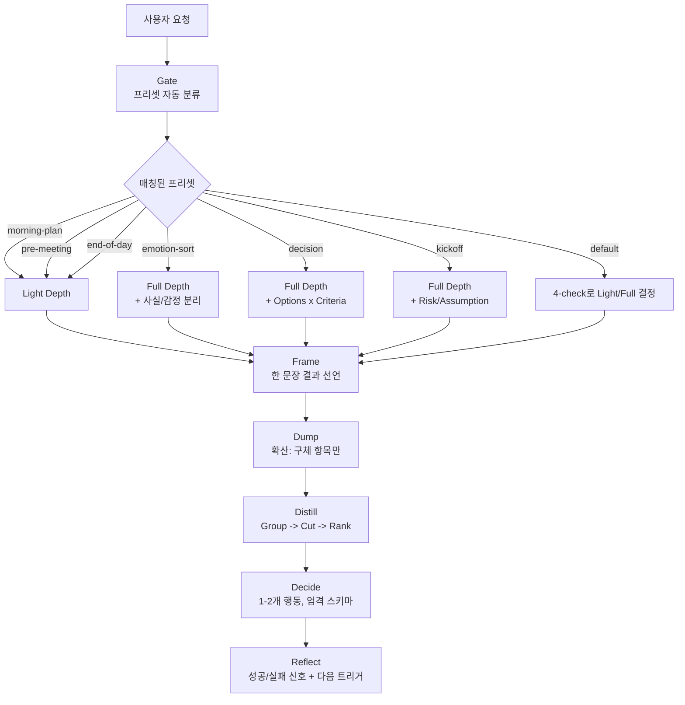

# 스킬 설명서: Two-Beat Thinking (두 박자 사고법)

- 대상 파일: [SKILL.md](SKILL.md)
- 영문 설명서: [README.md](README.md)
- 원본 방법론: [../../Two-Beat Thinking-method-and-product-spec.md](../../Two-Beat%20Thinking-method-and-product-spec.md)
- 작성일: 2026-07-22

이 문서는 `SKILL.md`가 **왜 이렇게 설계되었는지**를 한국어로 설명합니다. 스킬 자체는 AI가 안정적으로 로딩·재현할 수 있도록 영어로 작성되어 있습니다.

---

## 1. 스킬의 목적

원본 방법론(두 박자 사고법 / Two-Beat Thinking)을 **AI 어시스턴트가 실행할 수 있는 형태**로 옮긴 것입니다. 사람이 쓰던 원본에는 "5분 배출 + 5분 정리" 같은 타임박스가 있었지만, AI에게는 시간 개념이 무의미하므로 제거하고 **논리적 구조만 남겼습니다**.

한 줄 요약:

> "사용자의 두서없는 생각을 받아, 반드시 검증 가능한 하나의 실행 행동으로 끝맺도록 강제하는 스킬"

---

## 2. 원본 방법론에서 무엇을 유지하고 무엇을 버렸나

| 원본 요소 | 스킬 반영 여부 | 사유 |
|---|---|---|
| 5단계 구조 (Frame → Dump → Distill → Decide → Reflect) | ✅ 유지 (강제) | 방법론의 정체성. 하나라도 빠지면 실패로 정의 |
| 프리셋 (아침정리/회의전/감정정리/의사결정/킥오프/마감) | ✅ 유지 (Gate로 자동 분류) | 사용자 주제에 맞는 프레임 자동 선택 |
| 사고 프레임 라이브러리 (사실/감정, 통제 가능/불가능, Options×Criteria 등) | ✅ 유지 (프리셋별 overlay) | 상황에 맞게 자동 적용 |
| 결론 강제 (최대 2개 행동, 지금 시작 가능) | ✅ 유지 (엄격한 스키마) | 방법론의 핵심 강제력 |
| 순환 구조 (Reflect → 다음 세션 트리거) | ✅ 유지 | 일회성 브레인스토밍으로 전락하는 것 방지 |
| **타임박스 (1+5+5+2+2=15분)** | ❌ **제거** | **AI에게 시간 개념 불필요** |
| "손을 멈추지 않는다" 같은 감각적 규칙 | ❌ 제거 | AI에게 무의미 |
| 트리거 (캘린더 알림 등) | ❌ 제거 | 스킬 범위 밖 (제품 기능) |
| 사고 자산화, 버리는 서랍 | ❌ 제거 | 스킬 범위 밖 (제품 기능) |

---

## 3. 스킬 구조 한눈에 보기



---

## 4. 핵심 설계 결정과 이유

### 4.1 Gate를 "선행 강제"로 만든 이유

원본 스킬은 "필요할 때만 게이트를 돌려라"로 되어 있었지만, 그러면 AI가 자주 건너뜁니다. 사용자가 "먼저 필터링이 들어가야 한다"고 요구했으므로 **모든 호출에서 첫 단계로 프리셋을 명시하도록 강제**했습니다.

또한 Yes/No 3-check만으로는 감정 주제가 Light로 잘못 분류되는 위험이 있어, **4번째 체크(감정 부하)를 추가**하고 이 체크가 걸리면 무조건 Full + 사실/감정 분리 오버레이가 활성화되도록 했습니다.

### 4.2 Decide에 엄격한 스키마를 강제한 이유

원본 SKILL.md의 가장 큰 약점은 "행동을 내라"고만 하고 형식을 정하지 않은 것이었습니다. 그러면 AI는 흔히 "고려해보세요", "탐색해보세요" 같은 **실행 불가능한 조언**을 내놓습니다.

이 스킬은:

- 명령형 동사(Draft/Send/Choose/…)만 허용
- `consider/explore/think about` 문구는 명시적으로 거부
- `First step`은 **추가 입력 없이 바로 시작 가능**해야 함
- 진짜로 행동이 없으면 "무엇이 없어서 못하는지"를 명시한 후속 스프린트 예약을 대체 행동으로 강제

이 4개 규칙이 방법론 원문의 "동사+대상+시점, 30분 내 시작 가능" 조항을 AI 환경에 맞게 번역한 것입니다.

### 4.3 Reflect 단계를 추가한 이유

원본 SKILL.md에는 Reflect가 아예 없었습니다. Reflect가 없으면 스프린트는 **일회성 브레인스토밍**이 되고 순환 구조가 끊깁니다. `Success check / Failure check / Next sprint trigger` 3개를 강제해 다음 대화 세션까지 연결되는 훅을 만들었습니다.

### 4.4 Failure Conditions를 명시적으로 나열한 이유

AI 스킬의 재현성은 **"어떤 결과가 실패인지"를 명시적으로 정의할 때** 가장 안정적입니다. 8개의 실패 조건은 자기 점검 체크리스트 역할을 합니다.

---

## 5. 프리셋 분류표

| 프리셋 | 트리거 예시 | 자동 적용 프레임 | Depth |
|---|---|---|---|
| `morning-plan` | "오늘 뭐부터", "우선순위" | Now / Next / Later | Light |
| `pre-meeting` | "회의 전", "미팅 준비" | Goal / Question / Ask | Light |
| `emotion-sort` | "답답", "불안", "고민" | Fact vs Emotion, Controllable vs Not | Full |
| `decision` | "결정", "A vs B", "선택" | Options × Criteria 매트릭스 | Full |
| `kickoff` | "새 프로젝트", "킥오프" | Risk / Assumption / Unknown | Full |
| `end-of-day` | "마감", "정리하고" | Done / Pending / Carry-over | Light |
| `default` | 위에 없음 | Problem / Options / Action | 4-check로 결정 |

---

## 6. 출력물 예시 골격

```md
Preset: decision (Depth: Full)

Frame
벤더 A/B/C 중 이번 주 안에 1곳을 선정한다.

Dump
- A는 초기 비용이 30% 낮음
- B는 SLA가 99.95%로 가장 높음
- [assumption] C의 보안 감사 보고서는 곧 나올 예정
- ...

Distill
Themes
- 비용: [now] A 30% 저렴 / [later] 3년 TCO 비교
- 신뢰성: [now] B SLA 우위 / [drop] 과거 장애 소문
- 보안: [now] 감사 보고서 대기

Options × Criteria
| 기준 | A | B | C |
|---|---|---|---|
| 비용 | 5 | 3 | 4 |
| SLA | 3 | 5 | 4 |
| 보안 | 3 | 4 | ? |
| 합계 | 11 | 12 | 8+? |

Ranked Now-items
1. C의 감사 보고서 확보 (미확보 시 결정 불가)
2. B와 A의 3년 TCO 재계산

Decide
Action 1:
  Action:      Request C's security audit report
  First step:  Send email to C's account manager with the exact document list
  Rationale:   결정의 유일한 미확보 입력이며, 없으면 A/B/C 비교가 성립하지 않음
  Assumption:  담당자가 24시간 내 회신 가능
  Risk:        회신 지연 시 결정 기한을 놓침
  Validation:  이번 주 목요일까지 보고서 수령

Reflect
- Success check: 목요일 EOD까지 C 감사 보고서 수신
- Failure check: 목요일 EOD까지 미수신
- Next sprint trigger: 보고서 수신 직후 또는 목요일 EOD 미수신 시
```

---

## 7. 언제 쓰면 효과적인가

이 스킬은 **모든 사고 정리에 좋은 도구가 아닙니다.** 사용처를 잘못 고르면 오히려 답답합니다.

### 7.1 효과가 큰 상황 (강력 추천)

| 상황 | 왜 효과적인가 |
|---|---|
| **여러 선택지 사이에서 결정을 못 내리고 있을 때** | `decision` 프리셋의 Options × Criteria 매트릭스가 감정 편향을 걷어내고 점수로 비교시킴 |
| **머릿속이 시끄러워 무엇부터 손대야 할지 모를 때** | Dump 단계가 강제로 외부화 → Distill의 `[now]/[later]/[drop]` 태깅이 자동 우선순위화 |
| **걱정·불안이 반복 재생될 때** | `emotion-sort` 프리셋이 사실/감정, 통제 가능/불가능을 분리해 "쓸데없는 반추" 차단 |
| **회의나 대화 전에 30초 안에 요점을 정리해야 할 때** | `pre-meeting` 프리셋이 목표/질문/요청 3개로 압축 |
| **새 프로젝트를 시작하는데 어디부터 뚫어야 할지 막막할 때** | `kickoff` 프리셋의 Risk/Assumption/Unknown 표가 첫 실행 지점을 강제 도출 |
| **하루/한 주를 마감하며 잔여 사고를 비우고 싶을 때** | `end-of-day` 프리셋이 완료/보류/이월로 정리해 다음 사이클 재료로 전환 |
| **AI에게 조언을 받았지만 "그래서 뭘 하라는 거지?"로 끝날 때** | Decide 스키마가 "지금 첫 발"을 강제로 뽑아줌 |

### 7.2 효과가 작거나 오히려 방해되는 상황

| 상황 | 왜 부적합한가 | 대신 쓸 것 |
|---|---|---|
| **사실 조회형 질문** (예: "X 라이브러리 API 뭐 있어?") | 결정할 게 없음. Frame/Decide가 억지 구조가 됨 | 일반 대화 |
| **코딩 구현 작업** | 스킬 구조가 코드 작성 흐름을 오히려 끊음 | 일반 코딩 어시스턴트 |
| **긴 문서 요약** | Dump/Distill이 요약과 겹쳐 이중 정리가 됨 | 일반 요약 요청 |
| **감정을 그냥 털어놓고 싶을 때** (해결책 원치 않음) | Decide 강제가 위로가 아니라 압박으로 느껴짐 | 저널링/대화 |
| **이미 결정과 계획이 다 서 있을 때** | Gate → Frame → Dump가 오버헤드 | 바로 실행 지시 |
| **탐색적 리서치 초기** (뭘 모르는지도 모를 때) | 프리셋 매칭이 어려워 `default`로 떨어짐. 억지 결론이 나올 위험 | 자유 브레인스토밍 후 이 스킬 |

### 7.3 판단 기준 한 줄

> **"이 대화가 끝났을 때 내가 뭔가를 실행하고 있어야 하는가?"**
>
> - Yes → 이 스킬을 쓰세요.
> - No → 다른 방식이 낫습니다.

### 7.4 사용 강도 가이드

- **가벼운 주제**는 `Light` depth로 자동 처리되므로 부담 없이 자주 호출해도 됩니다.
- **무거운 주제**는 하루 1-2회 이상 반복 호출하지 마세요. `Reflect`의 `Next sprint trigger`가 걸리는 이벤트가 발생한 뒤 다시 부르는 것이 원칙입니다.
- **같은 주제로 3회 이상 스프린트를 돌렸는데 결론이 안 나면**, 스킬의 문제가 아니라 **입력 정보가 부족한 상태**입니다. `Schedule a follow-up sprint with <missing input>` 액션이 반복 등장한다면 그 입력을 먼저 구하세요.

---

## 8. 언제 이 스킬이 호출되나

`description` 필드가 트리거를 결정합니다. 다음과 같은 요청에서 자동 호출됩니다:

- "생각 정리해줘", "두 박자 사고법", "Two-Beat Thinking"
- "Stage 1, Stage 2로 뽑아줘"
- "brain dump", "dump and distill", "thought sprint"
- 옵션 저울질, 우선순위 정렬, 회의 준비, 킥오프 계획, 걱정 정리 등 **행동으로 끝나야 하는** 이데이션 요청

일반 코딩 질문에서는 트리거되지 않습니다.

---

## 9. 향후 개선 여지 (스킬 범위 밖)

원본 방법론에는 있지만 이 스킬에는 넣지 않은 것들. 필요하면 별도 스킬/제품 기능으로 분리 가능:

- 사고 자산화 (반복 키워드 하이라이트, 관심사 지도) → memory 스코프와 연동 가능
- 페어 세션, 버리는 서랍 → 제품 UX 기능
- 캘린더 트리거, 실행률 지표 → 제품 계측 영역

---

## 10. 유지보수 체크리스트

스킬을 수정할 때 아래를 확인하세요:

- [ ] Core Contract 6단계 중 하나를 지우면 방법론 정체성이 깨진다 — 지우지 말고 조정만
- [ ] Gate의 프리셋을 추가할 때는 트리거 신호를 **한국어와 영어 둘 다** 넣기
- [ ] Decide 스키마의 6개 필드는 하나라도 빠지면 실패 — 필드는 늘리지 말고 유지
- [ ] Failure Conditions는 스킬의 자기 검증 도구 — 규칙을 바꾸면 이 목록도 같이 갱신
- [ ] 이 설명서(README-ko.md)와 SKILL.md의 프리셋 표는 항상 일치시켜 유지
