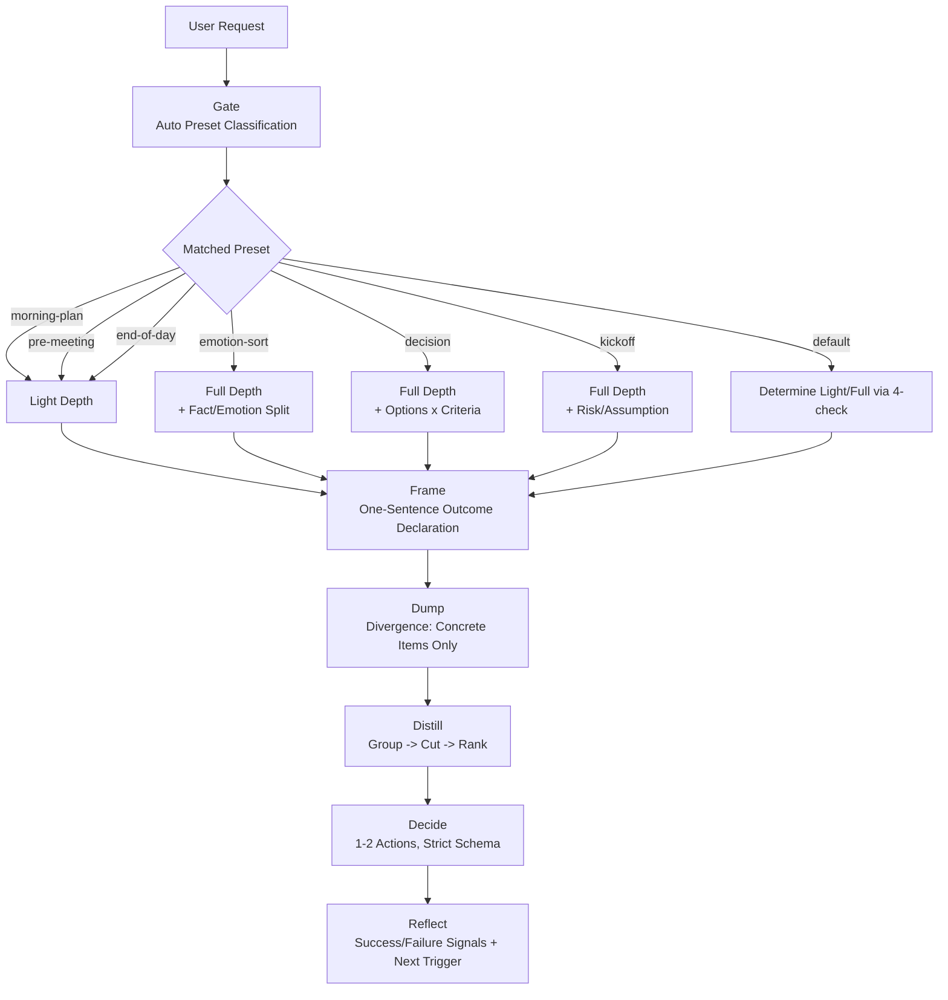

# Skill Specification: Two-Beat Thinking

- Target File: [SKILL.md](SKILL.md)
- Korean Documentation: [README-ko.md](README-ko.md)
- Original Methodology: [../../Two-Beat Thinking-method-and-product-spec.md](../../Two-Beat%20Thinking-method-and-product-spec.md)
- Date: 2026-07-22 (Updated: 2026-08-03)

This document explains **why `SKILL.md` was designed this way**. The skill itself is written in English so that AI assistants can reliably load and execute it.

---

## 1. Purpose of the Skill

This skill translates the original methodology (Two-Beat Thinking) into a format **executable by AI assistants**. While the human-oriented original version included time-boxes like "5-min Dump + 5-min Distill", the time concept is meaningless for an AI; thus, time-boxing has been removed, preserving **only the logical structure**.

One-Line Summary:

> "A skill that takes a user's unstructured thoughts and forces them into a validated, executable action."

---

## 2. What Was Kept vs. Removed from the Original Methodology

| Original Element | Retained in Skill? | Rationale |
|---|---|---|
| 5-Stage Structure (Frame → Dump → Distill → Decide → Reflect) | ✅ Retained (Enforced) | Identity of the methodology. Missing any step constitutes a failure. |
| Presets (morning-plan, pre-meeting, emotion-sort, decision, kickoff, end-of-day) | ✅ Retained (Auto-classified via Gate) | Automatically selects the frame matching the user's topic. |
| Thought Frame Library (Fact vs Emotion, Controllable vs Not, Options × Criteria, etc.) | ✅ Retained (Preset overlays) | Applied automatically depending on context. |
| Enforced Decision (Max 2 actions, immediately startable) | ✅ Retained (Strict Schema) | Core enforcement mechanism of the methodology. |
| Recurrent Structure (Reflect → Next session trigger) | ✅ Retained | Prevents degradation into one-shot brainstorming. |
| **Timeboxing (1+5+5+2+2=15 min)** | ❌ **Removed** | **Time concept is unnecessary for AI.** |
| Sensorial rules like "Keep your hand moving" | ❌ Removed | Meaningless for AI. |
| External Triggers (Calendar notifications, etc.) | ❌ Removed | Out of scope for skill (Product feature). |
| Thought Assetization, Trash Drawer | ❌ Removed | Out of scope for skill (Product feature). |

---

## 3. Skill Architecture at a Glance



---

## 4. Key Design Decisions & Rationales

### 4.1 Why Gate Was Made a Pre-emptive Enforcement

In earlier drafts, Gate was "run only when needed," but AI often skipped it. To satisfy the requirement for strict filtering, **stating the preset at the top is now mandatory on every invocation**.

Furthermore, a simple 3-check Yes/No system risked misclassifying emotional topics as Light depth. Thus, a **4th check (emotional load)** was added; triggering this check forces Full depth + Fact vs. Emotion split overlay.

### 4.2 Why a Strict Schema Was Enforced in Decide

The biggest flaw in unconstrained prompts is asking the AI to "produce an action" without specifying format. The AI then defaults to vague, unexecutable advice like "consider X" or "explore Y."

This skill enforces:
- Imperative verbs only (`Draft`, `Send`, `Choose`, etc.)
- Explicit rejection of phrases like `consider`, `explore`, `think about`
- `First step` must be **immediately executable without further inputs**
- If no action is viable, it forces a scheduled follow-up sprint with the missing input as the fallback action.

These 4 rules translate the original requirement ("Verb + Object + Timeframe, startable within 30 mins") into the AI environment.

### 4.3 Why the Reflect Stage Was Added

Reflect was missing from basic brainstorming prompts. Without Reflect, a session becomes **one-shot brainstorming** and breaks the loop. Enforcing `Success check / Failure check / Next sprint trigger` creates a hook connecting to subsequent conversation sessions.

### 4.4 Why Failure Conditions Were Explicitly Listed

AI skill reproducibility is most stable **when what constitutes a failure is explicitly defined**. The 8 failure conditions act as a self-verification checklist for the AI model.

---

## 5. Preset Classification Table

| Preset | Trigger Examples | Auto-Applied Frame | Depth |
|---|---|---|---|
| `morning-plan` | "today", "priorities", "what first" | Now / Next / Later | Light |
| `pre-meeting` | "before meeting", "prep" | Goal / Question / Ask | Light |
| `emotion-sort` | "anxious", "stuck", "frustrated" | Fact vs Emotion, Controllable vs Not | Full |
| `decision` | "choose", "A vs B", "should I" | Options × Criteria Matrix | Full |
| `kickoff` | "new project", "start", "kickoff" | Risk / Assumption / Unknown | Full |
| `end-of-day` | "wrap up", "review", "end of day" | Done / Pending / Carry-over | Light |
| `default` | None of the above | Problem / Options / Action | Determined by 4-check |

---

## 6. Sample Output Skeleton

```md
Preset: decision (Depth: Full)

Frame
Select 1 vendor out of A/B/C within this week.

Dump
- A has 30% lower initial cost
- B has highest SLA at 99.95%
- [assumption] C's security audit report is coming out soon
- ...

Distill
Themes
- Cost: [now] A 30% cheaper / [later] 3-year TCO comparison
- Reliability: [now] B SLA advantage / [drop] rumor about past outage
- Security: [now] Audit report pending

Options × Criteria
| Criteria | A | B | C |
|---|---|---|---|
| Cost | 5 | 3 | 4 |
| SLA | 3 | 5 | 4 |
| Security | 3 | 4 | ? |
| Total | 11 | 12 | 8+? |

Ranked Now-items
1. Obtain C's audit report (Decision impossible without it)
2. Recalculate 3-year TCO for A and B

Decide
Action 1:
  Action:      Request C's security audit report
  First step:  Send email to C's account manager with the exact document list
  Rationale:   The single missing input for decision; A/B/C comparison invalid without it
  Assumption:  Account manager can reply within 24 hours
  Risk:        Delayed reply causes missing decision deadline
  Validation:  Receive report by Thursday this week

Reflect
- Success check: C audit report received by Thursday EOD
- Failure check: Not received by Thursday EOD
- Next sprint trigger: Immediately upon receiving report OR Thursday EOD if not received
```

---

## 7. When It Is Effective

This skill is **not a universal tool for all thought processes.** Using it in the wrong context will feel restrictive.

### 7.1 Highly Effective Scenarios (Strongly Recommended)

| Scenario | Why It Works |
|---|---|
| **Stuck choosing between multiple options** | `decision` preset's Options × Criteria matrix eliminates emotional bias and compares by score |
| **Noisy mind, don't know where to start** | Dump stage forces externalization → Distill's `[now]/[later]/[drop]` tagging automatically prioritizes |
| **Looping anxiety or worries** | `emotion-sort` preset separates facts from emotions and controllable from uncontrollable, stopping unproductive rumination |
| **Need to summarize key points 30s before a meeting** | `pre-meeting` preset compresses into Goal / Question / Ask |
| **Starting a new project, overwhelmed where to begin** | `kickoff` preset's Risk/Assumption/Unknown table forces out the first execution point |
| **Wrapping up a day/week and want to clear mental leftovers** | `end-of-day` preset categorizes into Done / Pending / Carry-over for the next cycle |
| **Got advice from AI but left wondering "So what do I do?"** | Decide schema forcibly extracts the "very first step" |

### 7.2 Low Effectiveness or Counter-Productive Scenarios

| Scenario | Why It Is Unsuitable | What to Use Instead |
|---|---|---|
| **Fact-lookup queries** (e.g., "What APIs exist in library X?") | Nothing to decide. Frame/Decide become forced structure | Standard conversation |
| **Coding implementation tasks** | Skill structure disrupts coding flow | Standard coding assistant |
| **Long document summarization** | Dump/Distill overlaps with summarization, leading to redundant work | Standard summary request |
| **Venting emotions** (without wanting solutions) | Mandatory Decide feels oppressive rather than comforting | Journaling / Chat |
| **Decisions and plans are already complete** | Gate → Frame → Dump is overhead | Direct execution command |
| **Early exploratory research** (don't know what you don't know) | Preset matching falls back to `default`; risk of forced conclusions | Free brainstorming first, then this skill |

### 7.3 Decision Rule in One Line

> **"When this conversation ends, must I be executing something?"**
>
> - Yes → Use this skill.
> - No → Other methods are better.

### 7.4 Usage Frequency Guide

- **Light topics** are automatically handled at `Light` depth, so feel free to invoke often.
- **Heavy topics** should not be invoked repeatedly more than 1-2 times a day. Re-invoke only after the event in `Reflect`'s `Next sprint trigger` occurs.
- **If 3+ sprints on the same topic produce no conclusion**, it is not a skill problem but **a lack of input information**. If `Schedule a follow-up sprint with <missing input>` appears repeatedly, obtain that missing input first.

---

## 8. When Is This Skill Triggered?

The `description` field determines triggering. It is automatically invoked on requests like:

- "Help me organize my thoughts", "Two-Beat Thinking", "two-beat thinking"
- "Extract in Stage 1, Stage 2"
- "brain dump", "dump and distill", "thought sprint"
- Ideation requests that **must end in action**, such as weighing options, priority sorting, meeting prep, kickoff planning, anxiety sorting.

It will not be triggered on standard coding questions.

---

## 9. Future Improvement Areas (Out of Scope for Skill)

Elements in the original methodology not included in this skill; can be split into separate skills/product features if needed:

- Thought assetization (Highlighting recurring keywords, interest mapping) → Integratable with memory scope
- Pair sessions, Trash Drawer → Product UX features
- Calendar triggers, Execution metrics → Product telemetry area

---

## 10. Maintenance Checklist

When modifying the skill, verify the following:

- [ ] Deleting any of the 6 steps in Core Contract breaks the methodology's identity — adjust, don't delete.
- [ ] When adding Gate presets, include trigger signals in **both Korean and English**.
- [ ] All 6 fields of the Decide schema are mandatory — maintain fields without omitting.
- [ ] Failure Conditions are the skill's self-validation tool — update this list when rules change.
- [ ] Keep this guide (`README.md` & `README-ko.md`) synchronized with the preset table in `SKILL.md`.
